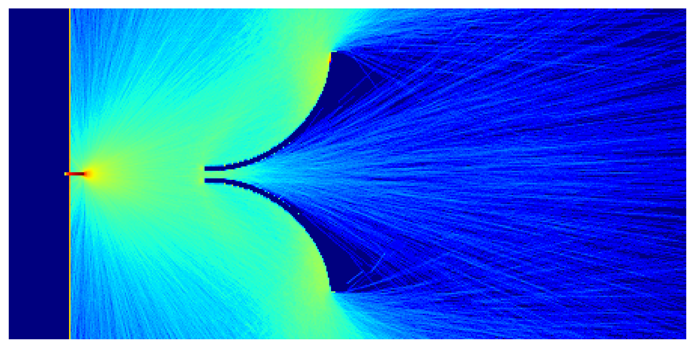

# Симуляция движения газа метод Монте-Карло для просчета его прохода через различные конструкции

## Описание

Для нахождение оптимальной формы конструкция для заданных целей требуется просчет движения газа. Гидродинамические методы не подходят для этого, поэтому для данной цели был применен статистический метод Монте-Карло.

В программе monte_carlo_calculation.py методом Монте-Карло происходит просчет координат частиц во времени

В программе density_conversion.py на основе координат частиц строятся двумерные профили плотности частиц

Программа density_show.py позволяет вывести полученные профили с нужными парметрами, а также сохранить в excel файл нужные характеристики газа.

## Пример просчета движения газа методом Монте-Карло при проходе скиммера.

